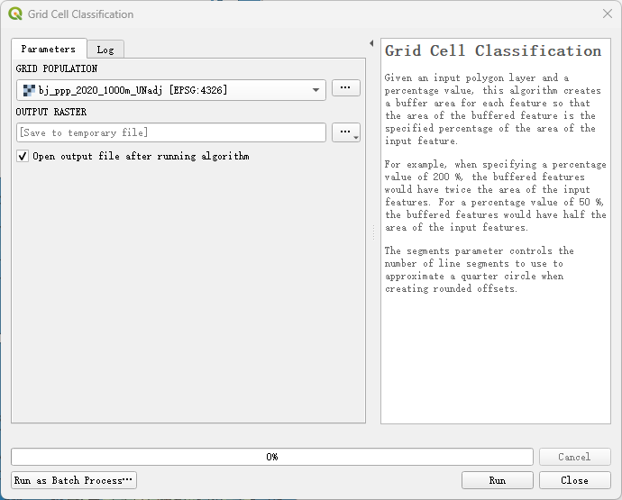

# Urban Boundary Extraction Software Based on Degree of Urbanization

## Project Introduction

This project aims to provide a tool for urban boundary extraction based on the Degree of Urbanization (DEGURBA) algorithm. By integrating multi-source geospatial data, it offers a fast, flexible, and efficient method for extracting urban boundaries at specific times and locations, providing technical support and data for researchers.

(a) Gridded population of Beijing in 2020.
(b) Grid cell level classification result by DEGURBA. 
(c) Local unit classification result by DEGURBA.

## Features

- **Multi-source Data Support**: Supports downloading WorldPOP and GPWV4 grid population data.
- **Grid Cell Classification**: Classifies grid cells into urban centers, urban clusters, and rural grid units based on population density, continuity, and scale.
- **Local Unit Classification**: Overlays the grid cell classification results onto local spatial units and further classifies them into urban areas, semi-dense areas, and rural areas.
- **Flexible and Efficient**: Users can generate urban boundary data with different time, location, and classification accuracy requirements.

## Installation

### Install using QGIS

#### 1. Install QGIS
- Download and install QGIS, version 3.20 or higher.

#### 2. Install rasterio
- In the QGIS QSGeo4W Shell, run `pip install rasterio`.

#### 3. Configure Plugin
- Place the project code folder into the QGIS plugin directory.
- Open QGIS, click on "Manage Plugins" and install the "DEGURBA" plugin.
- Open the Processing Toolbar and select the appropriate tools for operation.

### Install using Python

You can install the package using pip:

~~~
pip install degurba
~~~

## Usages with QGIS

1. **Download Population Data**:
   - Use the "download worldpop grid data" or "download gpwv4 grid data" tool to select the desired dataset, country, year, and clipping area (optional).

2. **Grid Cell Classification**:
   - Use the "Grid Cell Classification" tool, input the population grid data, and output raster data.

3. **Local Unit Classification**:
   - Use the "Local Units Classification" tool, input the grid cell classification result data, and output local unit data (vector data).

## Example

Using Beijing's data for the year 2020 as an example:

1. Download the WorldPOP population grid data for Beijing, setting the MASK layer to Beijing's vector boundary.

2. Perform grid cell classification on the downloaded population grid data.

3. Overlay the classification results onto Beijing's local spatial units (such as districts) to complete the local unit classification.

## Notes

- Ensure compatibility between QGIS version and the plugin.
- When downloading data, pay attention to selecting the correct dataset and parameters.
- When performing local unit classification, ensure that the input grid cell classification result data is complete and accurate.
